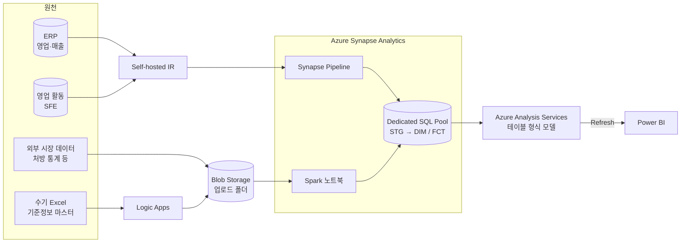

# 00. 대상 시스템과 담당 범위

## 대상 시스템 (구축: 타 인력)

제약사 영업 부문의 데이터를 통합해 Power BI 보고서로 제공하는 Azure 기반 DW. 이미 구축·운영 중이던 시스템이며, **구축에는 참여하지 않았다.**

- 원천 연결: 사내망 원천 → Self-hosted IR → Synapse Pipeline. 수기 Excel 은 Logic Apps 로 Blob Storage 에 올린 뒤 Spark 노트북이 읽는다.
- 적재: Dedicated SQL Pool 의 STG → DIM/FCT. 파이프라인은 저장 프로시저(Truncate 등)와 Copy 활동으로 구성된다.
- 제공: Analysis Services 모델을 Refresh 하고 Power BI 가 조회한다.

## 담당 범위

| 항목 | 내용 |
|---|---|
| 기간 | 2025.12 ~ 2026.03 |
| 역할 | Data Engineer — 운영 중 DW 유지보수 (단독 수행) |
| 대상 | 영업(Sales) 영역 파이프라인·노트북·DW 테이블·AAS Refresh |
| 성격 | 신규 개발이 아니라, 운영 중 발생한 장애·데이터 불일치의 원인 분석과 수정 |

## 케이스

| # | 케이스 | 증상이 보인 곳 | 원인이 있던 곳 |
|---|---|---|---|
| 1 | [DIM 누적 적재 → Refresh OOM](case1_dim_accumulation.md) | AAS Refresh (메모리 부족) | 파이프라인 저장 프로시저 파라미터 이름 |
| 2 | [제품 마스터 누락 → 매출 분류 불일치](case2_master_missing.md) | 시장 매출 FCT 금액·분류 | 기준정보(제품 마스터) |
| 3 | [Excel 스키마 자동 추론 실패](case3_schema_inference.md) | 제품 마스터 적재 실패 | pandas → Spark 변환의 타입 추론 |
| 4 | [Spark 런타임 변경 대응 리팩토링](case4_runtime_refactor.md) | (운영 전 점검) | 스토리지 접근 방식·파일 선택 책임·경로 |

케이스 1, 2 는 **증상이 보인 테이블과 원인이 있는 곳이 달랐다.** 결과 테이블에서 시작해 입력 쪽으로 한 단계씩 거슬러 올라가며 "여기는 정상인가"를 쿼리로 확인하는 방식으로 찾았다.
